# Dogfood Report: Draft Assistant

| Field | Value |
|-------|-------|
| **Date** | 2026-08-28 (draft day, ~07:00 PDT) |
| **App URL** | `http://localhost:1420` (fixture preview) and `http://localhost:1420/?replay=/live-state.json` (replay of the league's 2025 draft, my slot 2) |
| **Session** | Playwright-driven Chromium (agent-browser's `screenshot`/`record` hang in this environment, so Playwright drove the whole pass) |
| **Scope** | Everything reachable in a browser: setup, board (sort/filter/search), recommendations, manual pick + confirm dialog, clock banner and pick clock, side panel, live sync + health, Ask Claude panel, export/refresh/undo, keyboard + a11y, error paths, responsive, performance |
| **Commit under test** | `432949b` (after today's 12 bug-hunt fixes) |

## Summary

| Severity | Count |
|----------|-------|
| Critical | 0 |
| High | 1 |
| Medium | 7 |
| Low | 5 |
| **Total** | **13** |

The core loop is in good shape: live sync, the new pick clock, sorting, search,
the confirm dialog's auto-cancel, and chat settings all behave correctly under a
live replay (see [Verified working](#verified-working)). Every issue below is in
the *feedback* layer — what the app tells you after an action, and what it tells
a screen reader — plus one responsive-layout problem that bites on a laptop.

**Desktop-only paths could not be exercised**: macOS Tauri uses WKWebView, which
has no remote-debugging protocol, so real manual picks, real exports and real
Claude answers were tested only through their browser-preview error paths. Where
a finding is preview-specific, that is stated in the issue.

## Issues

### ISSUE-001: Failed "Live sync" shows a success toast while the button says sync is off

| Field | Value |
|-------|-------|
| **Severity** | high |
| **Category** | functional |
| **URL** | http://localhost:1420/ |
| **Repro Video** | videos/issue-001-live-sync-repro.webm |

**Description**

Clicking the live-sync pill when starting the poller fails shows the toast
**"Live sync on — polling Sleeper every 3s"**, while the pill itself still reads
**"○ Live sync off"** and nothing is polling. The underlying error ("browser
preview is read-only") is never shown — the success message replaces it.

The two messages share one slot, and the success notice is issued
unconditionally after the start attempt, so it overwrites the failure. This is
not cosmetic: the app's whole safety story is that you can trust the pill and
the messages. Here they contradict each other in the same frame, and the
message that survives is the false one. The same code path runs in the desktop
app whenever `start_polling` is rejected (no league loaded, backend not ready) —
the user would be told sync is on when it is not.

**Repro Steps**

1. Open `http://localhost:1420/` (browser preview, read-only)
   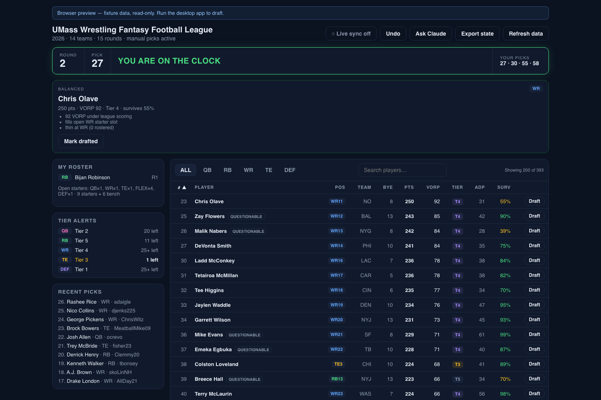

2. Hover the sync pill — it reads "○ Live sync off"
   

3. Click the pill. **Observe:** toast says "Live sync on — polling Sleeper every 3s"; the pill still says "○ Live sync off"; no error is shown anywhere
   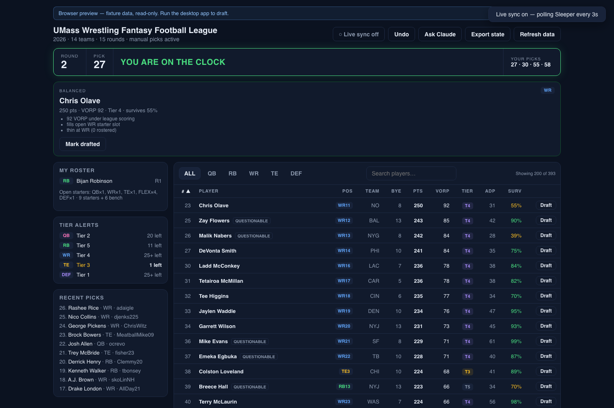

---

### ISSUE-002: "Refresh data" claims projections were refreshed in read-only preview

| Field | Value |
|-------|-------|
| **Severity** | medium |
| **Category** | functional |
| **URL** | http://localhost:1420/ |
| **Repro Video** | N/A (single action, visible immediately) |

**Description**

In browser preview nothing can be refetched, but pressing **Refresh data**
reports **"Projections refreshed and board rebuilt"**. The board is unchanged —
it is the same fixture. A user demoing the app (or checking whether stale
projections were the reason a player looks wrong) is told the data was rebuilt
when it was not.

**Repro Steps**

1. Open `http://localhost:1420/`, click **Refresh data**.
2. **Observe:** success toast "Projections refreshed and board rebuilt"; identical board.
   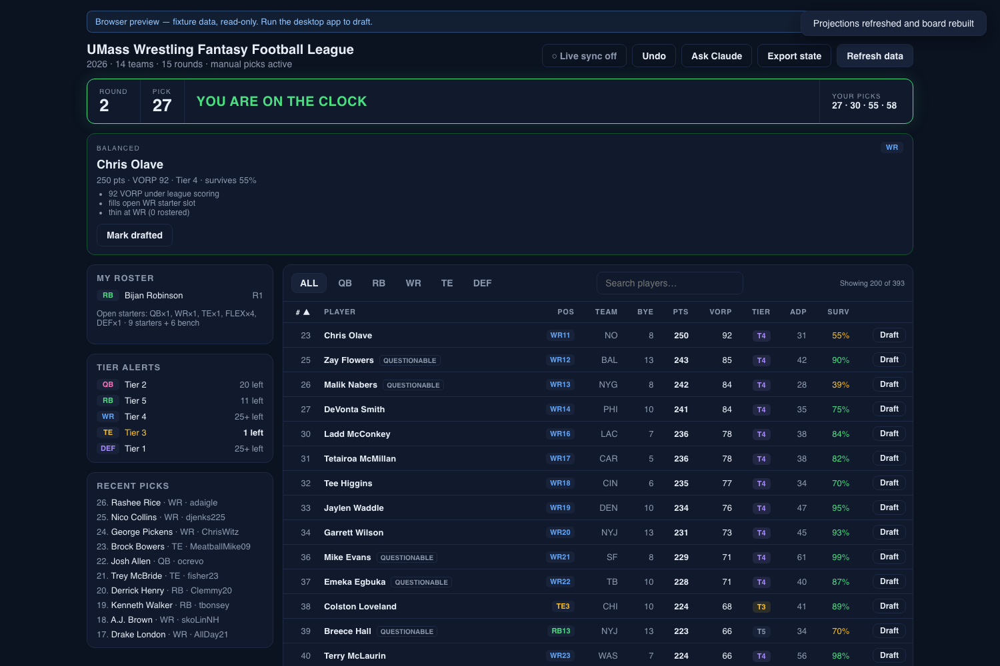

---

### ISSUE-003: "Export state" reports success with a non-path in the message

| Field | Value |
|-------|-------|
| **Severity** | medium |
| **Category** | ux |
| **URL** | http://localhost:1420/ |
| **Repro Video** | N/A |

**Description**

**Export state** in preview shows **"State exported: browser preview — no
export"** — the success template with an error string substituted for the file
path. Nothing was written. It should say plainly that export needs the desktop
app, in the failure style used elsewhere.

**Repro Steps**

1. Open `http://localhost:1420/`, click **Export state**.
2. **Observe:** toast reads "State exported: browser preview — no export".
   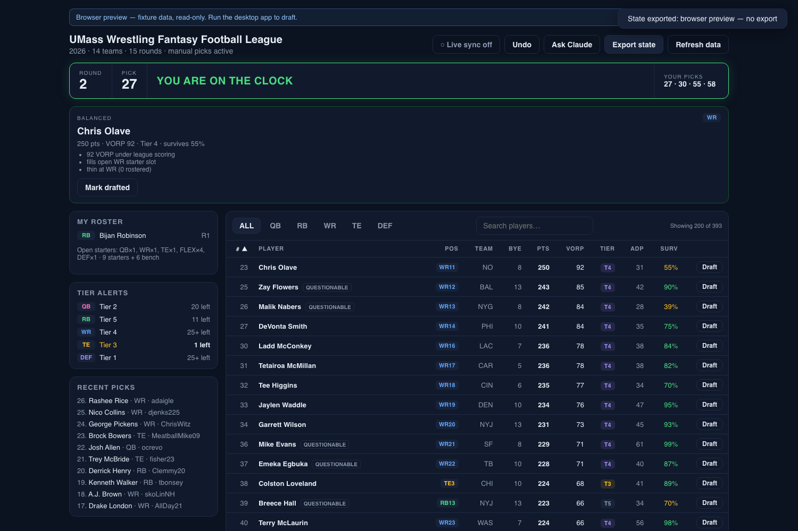

---

### ISSUE-004: A failed launch load silently drops the user on Setup with no error

| Field | Value |
|-------|-------|
| **Severity** | medium |
| **Category** | ux |
| **URL** | http://localhost:1420/?replay=/nope.json |
| **Repro Video** | videos/issue-004-setup-repro.webm |

**Description**

When the state source cannot be loaded at launch, the app renders the Setup
screen with **no message about what failed**. The failure notice the app
prepares is never displayed, because the failure bar only exists on the main
screen — and the app has already switched to Setup. The user is left with a form
and no idea the load failed. The same shape applies in the desktop app when the
saved league fails to load at launch (Sleeper down, bad cached id).

**Repro Steps**

1. Open `http://localhost:1420/?replay=/nope.json` — the replay source 404s.
   **Observe:** Setup screen, no error, no mention of the failed load.
   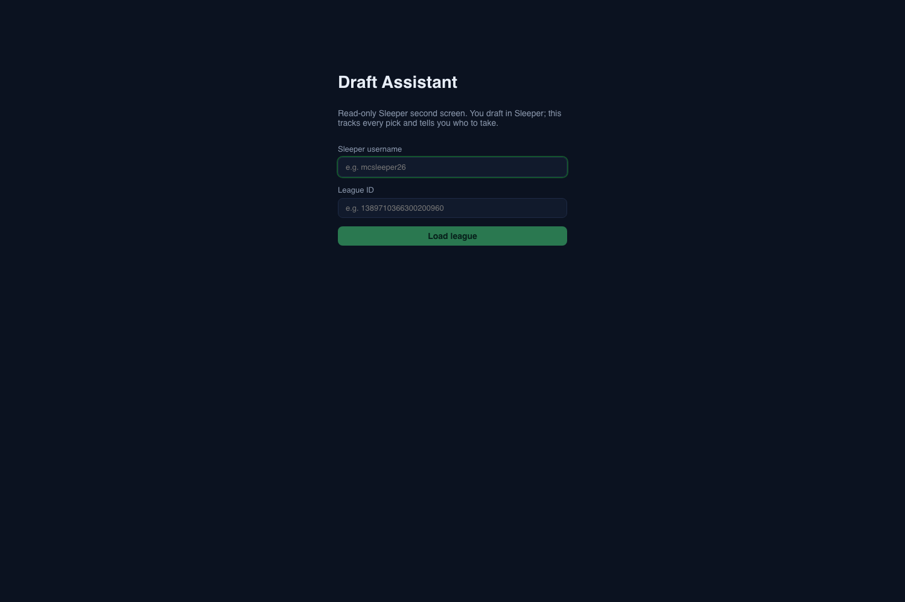

2. Fill in username and league id
   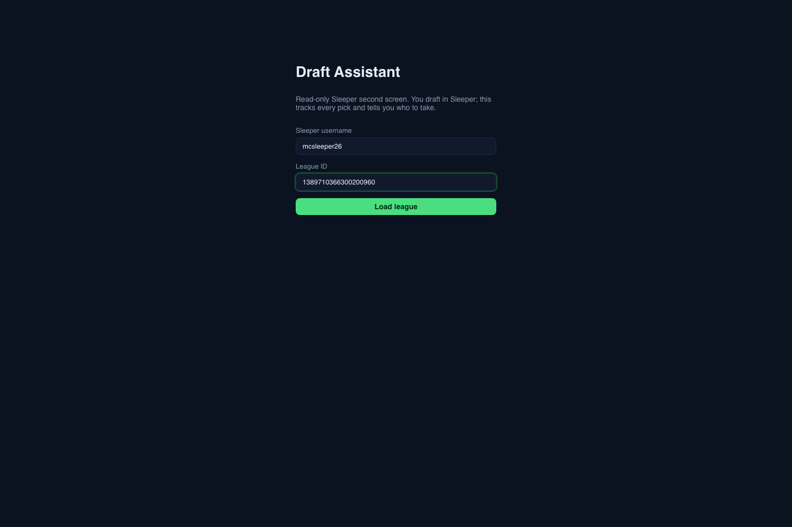

3. Press **Load league**. **Observe:** only now is an error shown — and it is the raw parser message of ISSUE-005.
   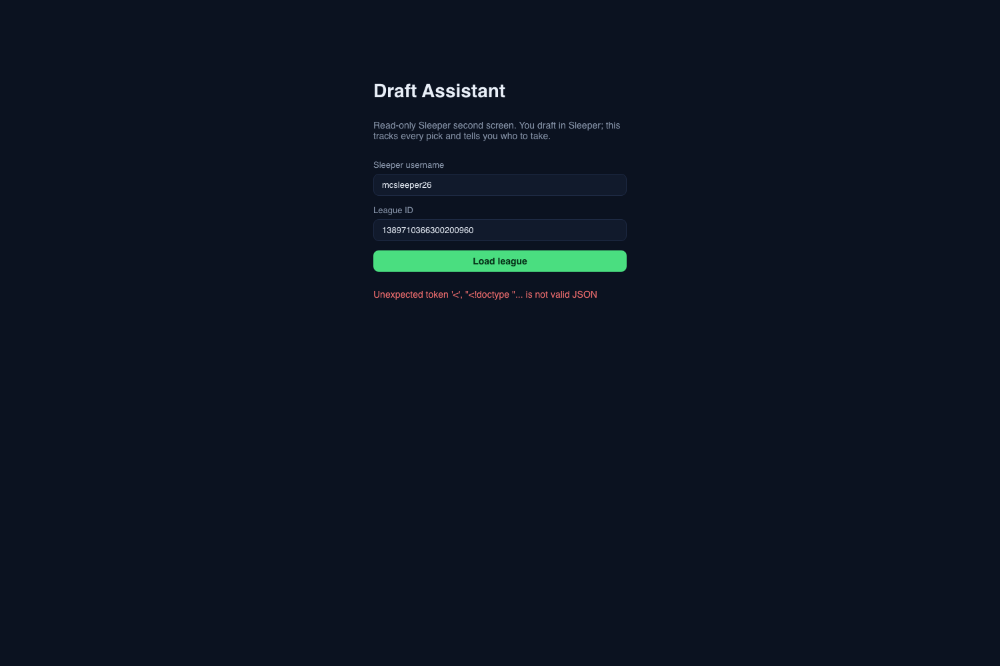

---

### ISSUE-005: Raw JavaScript parser error shown to the user on the Setup screen

| Field | Value |
|-------|-------|
| **Severity** | medium |
| **Category** | content |
| **URL** | http://localhost:1420/?replay=/nope.json |
| **Repro Video** | videos/issue-004-setup-repro.webm (same recording) |

**Description**

Setup surfaces the verbatim JS exception:

> `Unexpected token '<', "<!doctype "... is not valid JSON`

This is a developer message on the app's first screen, with nothing about what
went wrong or what to do. Every other failure in the app has a written,
actionable message (there is a whole troubleshooting table in the README); this
path escaped that treatment. Reproduces for any league id, valid or not, when
the state source returns non-JSON.

**Repro Steps**

1. Open `http://localhost:1420/?replay=/nope.json`, fill any league id, press **Load league**.
2. **Observe:** the red error under the button is the raw parser message.
   

---

### ISSUE-006: The clock banner re-announces itself to screen readers every second

| Field | Value |
|-------|-------|
| **Severity** | medium |
| **Category** | accessibility |
| **URL** | http://localhost:1420/?replay=/live-state.json |
| **Repro Video** | N/A (measured, see below) |

**Description**

The banner is a polite live region (`role="status" aria-live="polite"`) *and* now
contains the ticking pick clock, so its text changes once a second. A screen
reader therefore announces the banner every second for the entire draft, which
both floods the user and buries the one announcement that matters — "YOU ARE ON
THE CLOCK". Sampling the live region's text once a second:

```
ROUND 4 PICK 55 YOU ARE ON THE CLOCK CLOCK 1:24 YOUR PICKS 55 · 58 · 83 · 86
ROUND 4 PICK 55 YOU ARE ON THE CLOCK CLOCK 1:23 YOUR PICKS 55 · 58 · 83 · 86
ROUND 4 PICK 55 YOU ARE ON THE CLOCK CLOCK 1:22 YOUR PICKS 55 · 58 · 83 · 86
ROUND 4 PICK 55 YOU ARE ON THE CLOCK CLOCK 1:21 YOUR PICKS 55 · 58 · 83 · 86
ROUND 4 PICK 55 YOU ARE ON THE CLOCK CLOCK 1:20 YOUR PICKS 55 · 58 · 83 · 86
```

The countdown should sit outside the live region (or be `aria-hidden` with
coarse spoken milestones), leaving the region to announce state changes only.
A second polite region on the board count ("Showing 200 of 393") fires on every
search keystroke, adding to the chatter.

**Repro Steps**

1. Open the replay preview; inspect the banner: `role="status"`, `aria-live="polite"`.
2. **Observe:** the region's text changes every second while the clock runs.
   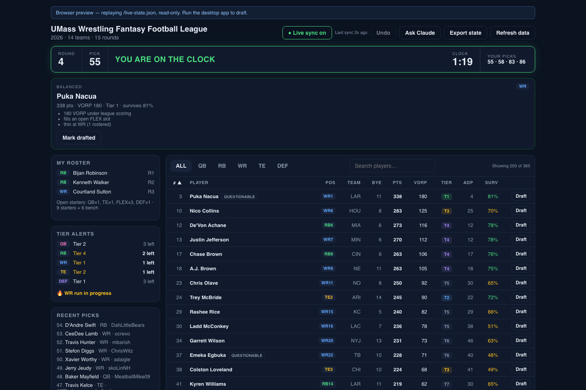

---

### ISSUE-007: With the chat open the board is cut off below 1680px — the Draft button is unreachable at 1440

| Field | Value |
|-------|-------|
| **Severity** | medium |
| **Category** | visual |
| **URL** | http://localhost:1420/ |
| **Repro Video** | N/A |

**Description**

The chat takes a fixed 380px column and the board is not re-flowed, so the table
is clipped at every common laptop width. Measured with the chat open:

| Viewport | Board width | Last visible column |
|---|---|---|
| 1680 | 946px | all 11 (no clipping) |
| 1440 | 726px | SURV — **Draft button cut off** |
| 1280 | 566px | VORP — tier, ADP, survival and Draft all cut off |
| 1152 | 438px | TEAM |
| 1024 | 310px | PLAYER — rank and name only |

At 1440 (the default scaled resolution of a 14"/16" MacBook Pro) you cannot
draft from the board while the chat is open without scrolling the table
sideways, and there is no visible scrollbar to suggest it. The panel's stated
purpose — "the numbers being asked about stay visible next to the answer" — is
defeated exactly where it is most needed.

**Repro Steps**

1. Open the app at 1024×800, click **Ask Claude**.
   **Observe:** only rank and player name remain; the position filter row is clipped mid-"DEF".
   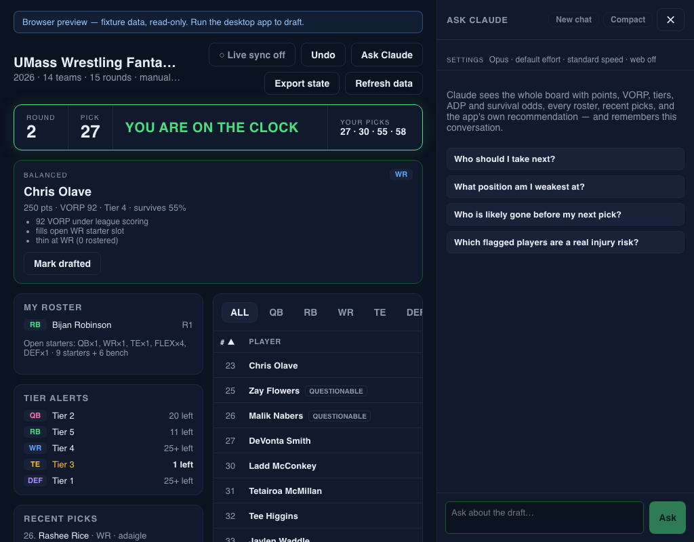

2. Same at 1280 — tier/ADP/survival and the Draft button are gone.
   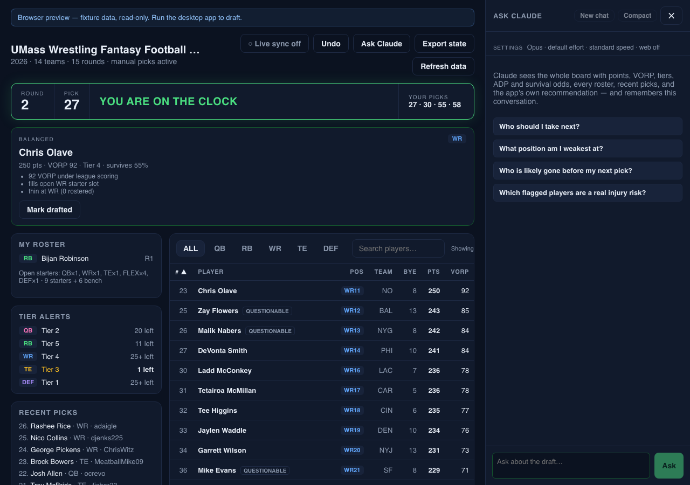

---

### ISSUE-008: A stalled feed still shows a green "Live sync on" pill, and the sync age freezes

| Field | Value |
|-------|-------|
| **Severity** | medium-low (replay/preview mode) |
| **Category** | ux |
| **URL** | http://localhost:1420/?replay=/live-state.json |
| **Repro Video** | N/A |

**Description**

With the replay feed killed, the app kept showing **"● Live sync on"** in green
with **"Last sync 3m ago"** — and that age never advanced across 60s of
sampling, because the label is only recomputed when an update arrives. So the
one number that tells you how stale the board is stops moving precisely when the
data goes stale. Five samples, 15s apart, after killing the feed:

```
● Live sync on / live on / Last sync 3m ago   (×5, unchanged)
```

In the desktop app a poll failure turns the pill red, so the green pill here is
preview-specific; the frozen age is a general defect that only becomes visible
when updates stop.

**Repro Steps**

1. Open the replay preview with the replay server running (pill green, age counting).
2. Kill the replay server; wait a minute.
3. **Observe:** pill still green, age frozen at "3m ago", no warning.
   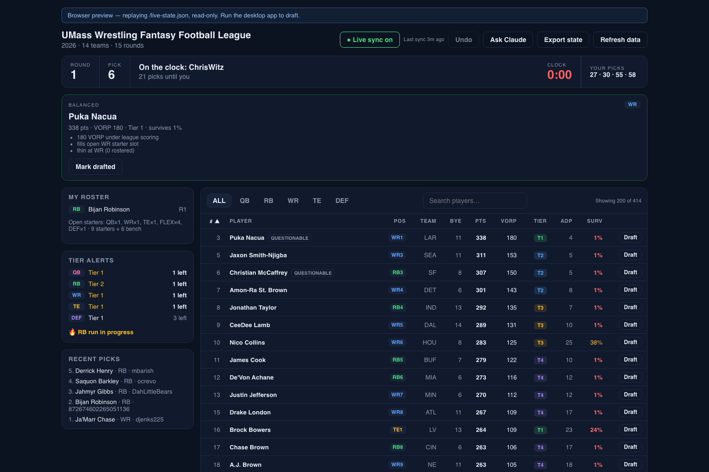

---

### ISSUE-009: Recent picks show a raw 19-digit Sleeper user id instead of a manager name

| Field | Value |
|-------|-------|
| **Severity** | low |
| **Category** | content |
| **URL** | http://localhost:1420/?replay=/live-state.json |
| **Repro Video** | N/A |

**Description**

When a pick's user id cannot be resolved to a display name, the list prints the
id itself:

> `58. Deebo Samuel · WR · 872674602265051136`

The intended fallback ("slot N") never triggers, because the unresolved id is
passed on as if it were a name. Any league member without a display name — and
every pick in replay mode — reads like this.

**Repro Steps**

1. Open the replay preview and look at **Recent picks** for a pick made by the substituted user.
2. **Observe:** the raw id in place of a name.
   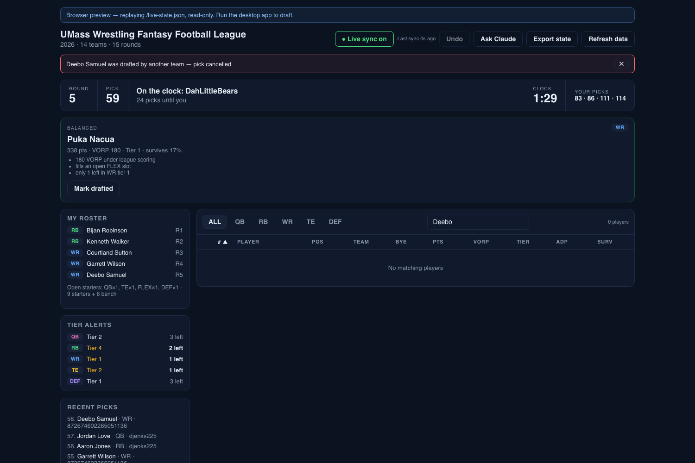

---

### ISSUE-010: Board table has no column semantics; heading levels skip from h1 to h3

| Field | Value |
|-------|-------|
| **Severity** | low |
| **Category** | accessibility |
| **URL** | http://localhost:1420/ |
| **Repro Video** | N/A |

**Description**

The 11-column, 200-row board has no `<caption>` and no `scope` attribute on any
`<th>` (all eleven return `null`), so a screen reader cannot tie "T4" or "31" to
"Tier" or "ADP" while moving through cells. The document also jumps from `h1`
(league name) straight to `h3` (My roster / Tier alerts / Recent picks) with no
`h2`. Everything else in this area is right: one `h1`, header/main/aside
landmarks, all inputs labelled, no unnamed buttons, visible focus on every tab
stop, and text contrast passes AA everywhere measured (5.95:1 for muted body
text, 14.9:1 for player names).

**Repro Steps**

1. Open the app; inspect `.board thead th` — no `scope`, no caption; heading order is `h1, h3, h3, h3`.
   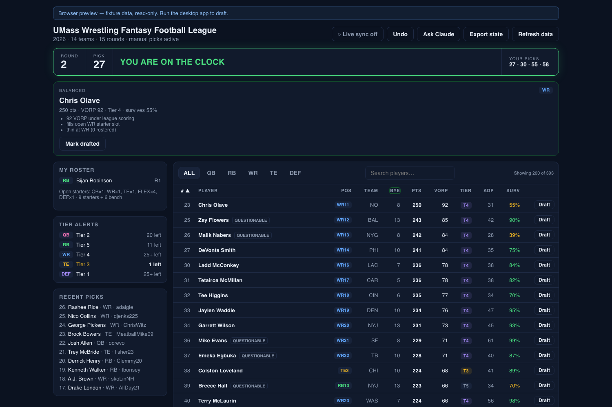

---

### ISSUE-011: Draft buttons stay enabled after the draft is complete

| Field | Value |
|-------|-------|
| **Severity** | low |
| **Category** | ux |
| **URL** | http://localhost:1420/?replay=/live-state.json (replay set to 210/210) |
| **Repro Video** | N/A |

**Description**

With the draft finished the banner correctly says "Draft complete", the
recommendation cards are gone and "Your picks" shows "–", but all 200 board rows
still offer an enabled **Draft** button. Pressing one opens the confirm dialog
and the pick is only refused after **Confirm**, by the backend. The button
should be disabled once there is nothing left to draft, like Undo now is.

**Repro Steps**

1. Set the replay to the final pick and reload.
2. **Observe:** "Draft complete", no recommendations, but every row still has an active Draft button.
   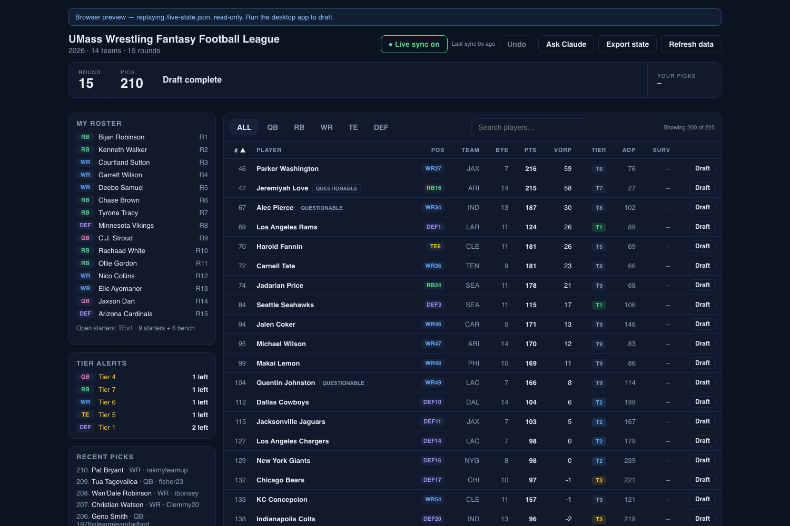

---

### ISSUE-012: Pre-draft banner shows a start time that has already passed, with no date

| Field | Value |
|-------|-------|
| **Severity** | low |
| **Category** | content |
| **URL** | http://localhost:1420/?replay=/live-state.json (replay rewound to 0 picks) |
| **Repro Video** | N/A |

**Description**

The banner reads **"Draft has not started · starts 6:31 AM"** for a start time
that is already in the past, with nothing to say so, and no date. On draft day
this is the state you see if the scheduled time passes before the commissioner
starts the draft: the app will keep saying "starts 5:00 PM" at 5:20 PM. A
relative form ("starts in 12 min" / "start time passed — waiting for the
commissioner") would say what is actually going on.

**Repro Steps**

1. Rewind the replay to 0 picks and reload.
2. **Observe:** "Draft has not started · starts 6:31 AM" — a time in the past.
   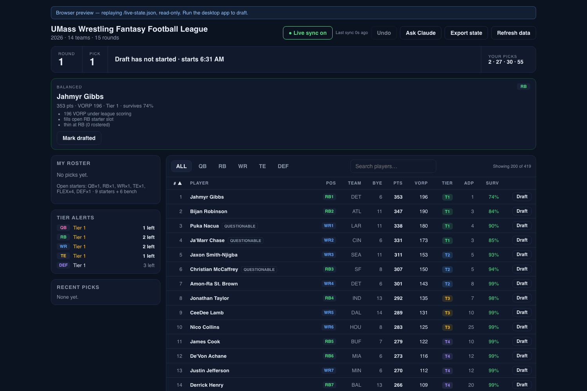

---

### ISSUE-013: The preview fixture is stale — it demos bugs that were fixed today

| Field | Value |
|-------|-------|
| **Severity** | low |
| **Category** | content |
| **URL** | http://localhost:1420/ |
| **Repro Video** | N/A |

**Description**

The fixture behind the plain browser preview predates today's model fixes, so
the demo shows output the engine no longer produces:

| | Fixture preview | Live engine (replay) |
|---|---|---|
| DEF tiers | every defense "T1", alert "DEF Tier 1 · 25+ left" | T1–T4, alert "DEF Tier 1 · 3 left" |
| Survival | old unconditional numbers (55 % / 90 % / 99 %) | conditional (15 % / 3 % / 11 %) |
| Board size | 393 players | 419 / 362 |

Anyone opening the preview to see the app — and the 11 Playwright E2E tests,
which assert against this same file — is looking at the pre-fix model, including
the exact "all 32 defenses in tier 1" bug fixed in `7115c33`.

**Repro Steps**

1. Open `http://localhost:1420/` and filter to DEF; every row reads T1.
   

---

## Verified working

Tested and correct — worth recording so the next pass need not redo it:

| Area | Result |
|---|---|
| Board sorting | All 10 columns sort, `aria-sort` correct, second click flips, sensible first direction (Pts/VORP/Surv descending first), blanks last, ties broken by rank, sorts the whole 393 not just the visible 200 |
| Position filter | ALL/QB/RB/WR/TE/DEF filter correctly, no K offered (league has no K slot), counts match |
| Search | Case-insensitive, trims whitespace, matches team names ("49ers" → SF DEF), finds players beyond the 200-row cap, "No matching players" empty state |
| Confirm dialog | Opens focused on Confirm, native modal with backdrop, Escape cancels, backdrop click cancels, and **auto-cancels correctly** when the pending player is drafted live: dialog closed itself and the bar read "Deebo Samuel was drafted by another team — pick cancelled" (video `verified-dialog-autocancel.webm`) |
| Escape precedence | With both open, Escape closes only the dialog and leaves the chat |
| Pick clock | Counts down in real time (1:24 → 1:20 sampled), red under 10 s, stops at 0:00, absent when the draft is pre-draft/complete/untimed |
| Live sync (replay) | Picks land within one poll; clock, roster, recent picks, tier alerts and the board all follow; sort + filter + search survive updates unchanged |
| Survival live | Updates sensibly as the draft moves (Achane 14 % → 18 % between picks 41 and 42) |
| Ask Claude panel | Focus goes to the input, suggestions work, Enter submits, empty Enter does nothing, Ask/New chat/Compact correctly disabled when empty, ✕ labelled "Close chat", settings persist across reload, error text for the unavailable backend is clear ("browser preview cannot reach the Claude CLI — run the desktop app") |
| Undo | Disabled with no manual picks, with an explanatory tooltip |
| Draft complete / pre-draft | Correct banner text, no recommendations after completion, roster of 15 |
| Console | No JS errors, no failed requests, no warnings in any scenario |
| Performance | 126 ms to interactive, 16 MB heap, smooth scrolling over 200 rows (~15 ms/frame) |
| Contrast | Passes WCAG AA everywhere measured |

## Notes on coverage

- Desktop-only behaviour (real manual picks, real export, real Claude answers,
  poll-failure colouring of the pill) is untestable from this harness: Tauri on
  macOS uses WKWebView, which exposes no debugging protocol.
- The Setup screen could only be reached through a failed load (ISSUE-004);
  in preview it cannot complete, so validation of a real league id was not
  exercised end to end.

---

## Results — all 13 fixed (2026-08-28, 07:00–08:15 PDT)

Each issue got a test that failed against the old behaviour, then the fix, then
the test green, then the whole suite. `bun run verify` (LOC cap, fmt, tsc,
build, Rust 104 tests, Vitest 54, Playwright 14, clippy, eslint) exits 0 at
`fdbdbfa`.

| # | Commit | Test written first (red → green) | Verified in the app |
|---|--------|----------------------------------|---------------------|
| 001 | `5c7d672` | `App › reports a failed live-sync start instead of claiming sync is on` | Pill stays "○ Live sync off", bar reads "browser preview is read-only — live sync requires the desktop app", no success toast (`verify-02-live-sync.png`) |
| 002 | `5c7d672` | `api › refuses export and data refresh in the fixture preview` | "browser preview is read-only — run the desktop app to refresh projections"; in replay mode Refresh reloads the dump and says so |
| 003 | `5c7d672` | same test, export half | "browser preview is read-only — run the desktop app to export state" (`verify-03-export-refresh.png`) |
| 004 | `5c7d672` | `App › says why the saved league failed to load instead of a bare setup screen` | The alert now renders above Setup (`verify-04-bad-replay.png`) |
| 005 | `5c7d672` | `api › explains a state source that is not draft state` | "could not read draft state from /nope.json — it is not a state dump (check the path, and that the replay server is writing it)" (`verify-05-setup-error.png`) |
| 006 | `6fffbb4` | `ClockBanner › keeps the ticking countdown out of the live region` | The live region is `.clock-main` and reads "YOU ARE ON THE CLOCK" only; the countdown is outside it and still labelled "Pick clock" |
| 007 | `6232c9d` | E2E `board stays usable with the chat open › no clipped columns at 1440/1280/1024px` | Table fits its column at every width; all 11 columns visible; side panel drops below the board under 1500px, chat floats under 1200px (`fix-007-1280.png`) |
| 008 | `ec1ff0a` | `App › keeps the sync age moving and flags a feed that has gone quiet` | Feed killed: "Last sync 5s ago" → "40s ago" → "1m ago", pill turns "● Sync stale · nothing for 1m" (`verify-08-feed-stalled.png`) |
| 009 | `d0c54eb` | `view_feed › an_unresolvable_user_id_is_no_name_at_all` | Recent picks read "29. Javonte Williams · RB · 197lbsleanmeandadbod" |
| 010 | `6fffbb4` | `Board › names its columns for assistive technology`, `SidePanel › uses second-level headings` | 11× `scope="col"`, caption "Available players, sorted by #", headings h1/h2/h2/h2 |
| 011 | `5c7d672` | `Board › offers no draft action once the draft is complete`, `App › disables drafting once the draft is complete` | At 210/210 all 200 Draft buttons disabled, title "The draft is complete" (`verify-06-draft-complete.png`) |
| 012 | `6fffbb4` | `ClockBanner start time › says the draft is late once its start time has passed` | "Draft has not started · scheduled for 7:10 AM — waiting on the commissioner" (`verify-07-pre-draft.png`) |
| 013 | `fdbdbfa` | E2E now reads the moving values off the page instead of hard-coding a player | Fixture regenerated from the current engine: schema 1.3, banded DEF tiers, conditional survival, real manager names |

## Found while fixing: this league has keepers

Regenerating the fixture from live data (ISSUE-013) turned up something the
browser pass could not see — **the 2026 draft already holds 23 keepers**, at
picks 11, 14, 20 … 177, while its status is still `pre_draft`. Three defects
followed, all fixed and covered by `src-tauri/tests/keepers.rs`:

| # | Severity | Defect | Commit |
|---|---|---|---|
| 014 | **critical (tonight)** | `current_pick` was the pick *count* + 1, so with 23 keepers the app said "Round 2, Pick 24" before anyone had picked, and listed "your picks" from 27 instead of 2. It is now the lowest unfilled pick number; `my_next_picks` drops numbers a keeper already used, and `picks_until_mine` counts only picks that still have to happen. | `aedfa8f` |
| 015 | **critical (tonight)** | The manual-pick fallback was dead in this league: `merged_picks` kept only manual picks numbered above every API pick, and a keeper sits at 177 — so anything marked by hand was silently discarded. Merging is now keyed on the pick number, and a manual pick takes the next open one. | `aedfa8f` |
| 016 | medium | Recent picks and the positional-run detector were fed by keepers the draft had not reached (the panel led with picks 177, 165, 163 while the draft was on pick 30). Both now consider only picks below the clock. | `467ba44` |

The simulator was made keeper-aware too, so `dump_state --simulate` drafts at
the real next pick rather than at `n + 1`.
