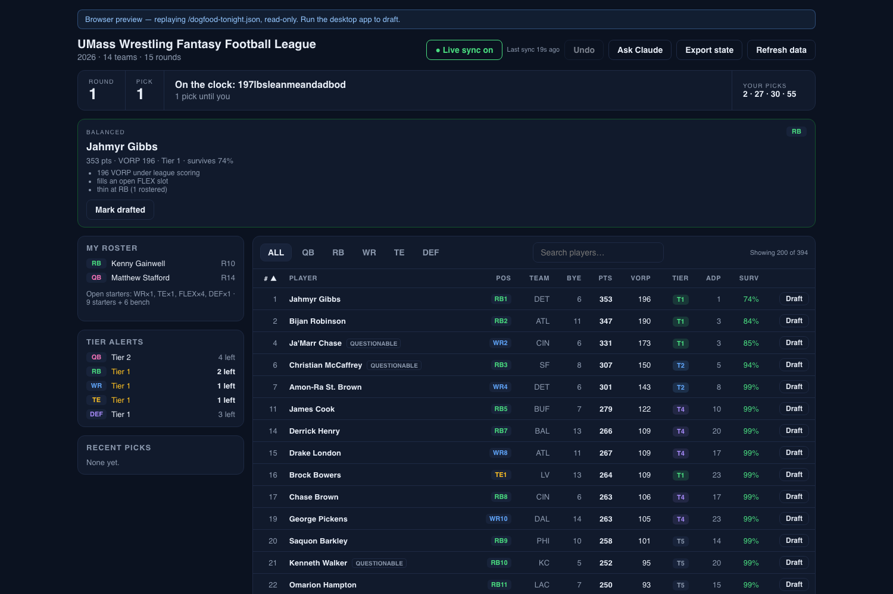
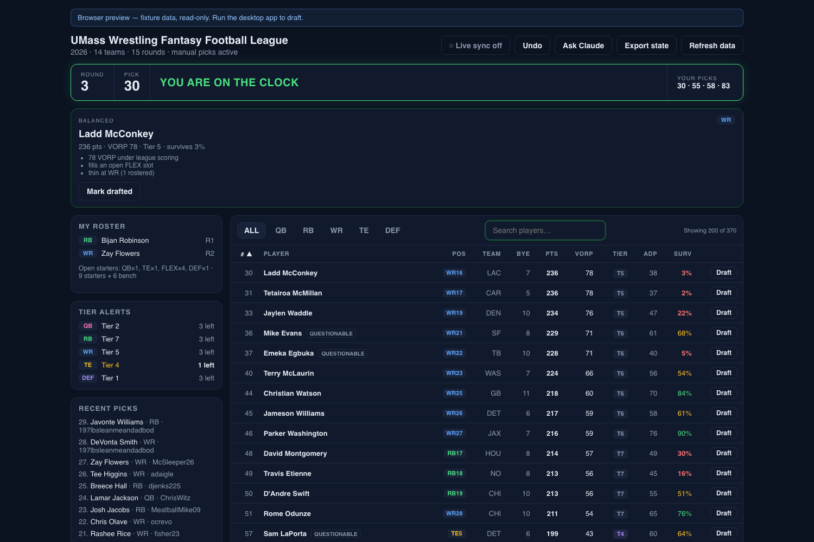
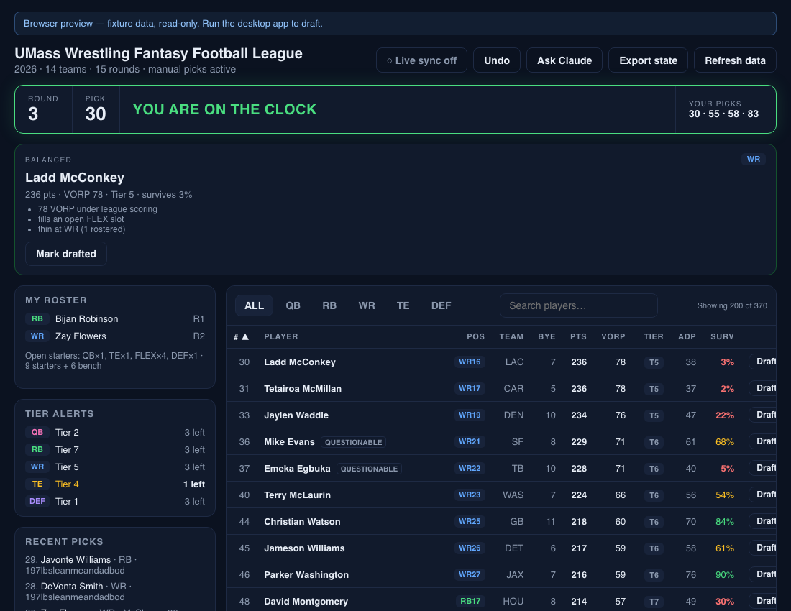

# Dogfood Report: Draft Assistant — pass 2

| Field | Value |
|-------|-------|
| **Date** | 2026-08-28, ~08:20–09:10 PDT (draft at 17:00) |
| **App URL** | `http://localhost:1420` (keeper-league fixture), `?replay=/live-state.json` (live replay), `?replay=/dogfood-tonight.json` (tonight's real pre-draft state) |
| **Session** | Playwright-driven Chromium |
| **Scope** | Second pass over the whole app after the 13 pass-1 fixes and the keeper work: regressions, paths pass 1 never reached (malformed data, corrupt settings, interaction races, soak), and tonight's real league state rendered end to end |
| **Commit under test** | `76f70d7` |

## Summary

| Severity | Count |
|----------|-------|
| Critical | 0 |
| High | 1 |
| Medium | 0 |
| Low | 3 |
| **Total** | **4** |

Pass 1's findings all hold up, and the areas it could not reach came back clean:
the error boundary catches malformed state, corrupt saved settings fall back to
defaults, interaction races behave, and a five-minute soak against a live replay
stayed flat. The one serious finding is a keeper consequence the browser pass
could not have seen before today — **the app tells you a draft is under way ten
hours before it starts**, on the very screen you will be looking at this
afternoon.

## Issues

### ISSUE-P2-001: With keepers, the app claims the draft is live before it starts

| Field | Value |
|-------|-------|
| **Severity** | high |
| **Category** | functional |
| **URL** | http://localhost:1420/?replay=/dogfood-tonight.json (tonight's real state, dumped at 08:35) |
| **Repro Video** | N/A (visible on load) |

**Description**

Tonight's draft is `pre_draft` and starts at 17:00. At 08:35 the banner reads:

> **ROUND 1 · PICK 1 · On the clock: 197lbsleanmeandadbod · 1 pick until you**

There is no clock — nobody is on it — and the scheduled start time, which the
app now knows how to show, never appears. The "draft has not started · starts
5:00 PM" line only renders when *no picks exist*, and this league's 25 keepers
count as picks. So the wording that was fixed this morning (ISSUE-012) is
unreachable in exactly the league it was written for, and instead the screen
implies the draft is already running.

Consequences on the pre-draft screen: a manager name is shown "on the clock"
who is not; "1 pick until you" reads as a live countdown; and there is no
confirmation anywhere that the app knows when the draft begins.

**Repro Steps**

1. Load a `pre_draft` league that has keepers (tonight's league, 25 of them).
   **Observe:** "On the clock: …" and "1 pick until you" instead of "Draft has
   not started · starts 5:00 PM".
   

---

### ISSUE-P2-002: Tier badges T5 and deeper all share one colour

| Field | Value |
|-------|-------|
| **Severity** | low |
| **Category** | visual |
| **URL** | http://localhost:1420/ |
| **Repro Video** | N/A |

**Description**

This morning's tier fix (splitting bands that span more than 1.5× the gap)
raised tier numbers well past five — the board now shows T1…T14 and the engine
goes to T17. The badge colour is picked with `min(tier, 5)`, so **ten distinct
tiers — T5 through T14 — render in exactly the same colour**, measured from the
page:

```
one colour: T5 T6 T7 T8 T9 T10 T11 T12 T13 T14
own colour: T4 | T3 | T2 | T1
```

The tier column stops carrying a visual signal below the top four bands, and
side-panel alerts now read "RB Tier 7 · 3 left", a number that invites
comparison with "DEF Tier 1 · 3 left" when the two are not on the same scale.

**Repro Steps**

1. Open the app and read down the Tier column.
   **Observe:** every badge from T5 down looks identical.
   

---

### ISSUE-P2-003: The `injured` row class does nothing

| Field | Value |
|-------|-------|
| **Severity** | low |
| **Category** | visual |
| **URL** | http://localhost:1420/ |
| **Repro Video** | N/A |

**Description**

33 of the 200 visible rows carry `class="injured"`, and it has no rule anywhere:
background, colour, opacity, border and text style are byte-identical to a plain
row. Either the intent (dimming flagged players) was lost, or the class should
go — as it stands it is markup that promises styling and delivers none. The
injury *badge* beside the name still conveys the information, so no user is
misled today; this is a trap for whoever next tries to style the row.

**Repro Steps**

1. Compare a row with `.injured` against one without in the page: all computed
   style properties match.
   

---

### ISSUE-P2-004: The board silently overflows its container at ~1100px

| Field | Value |
|-------|-------|
| **Severity** | low |
| **Category** | ux |
| **URL** | http://localhost:1420/ |
| **Repro Video** | N/A |

**Description**

With the chat closed at 1100×850 the table is 786px inside a 766px column, so
the last column is cut and the container scrolls horizontally. macOS overlay
scrollbars mean nothing is visible until you scroll, so the Draft button simply
looks missing. Twenty pixels is a near miss rather than a layout failure, and
the chat-open case was fixed this morning (ISSUE-007) — this is the same class
of problem in the no-chat path at one narrow width.

**Repro Steps**

1. Set the viewport to 1100×850 with the chat closed.
   **Observe:** table 786px wide in a 766px container; `overflow-x: auto` with
   no visible affordance.
   

---

## Verified working

Everything below was exercised this pass and behaved:

| Area | Result |
|---|---|
| **Tonight's real state** | Dumped live and rendered: pick 1, round 1, `picks_until_mine` 1, my picks `2 · 27 · 30 · 55` with my keepers at 139 and 195 correctly **excluded**, both keepers on my roster as R10/R14, open starters recomputed around them (QB and RB already filled), 394 of 419 players available, no warnings |
| Keeper handling | Keepers never appear on the board, never lead "Recent picks" ("None yet." pre-draft), never advance the clock |
| Error boundary | A dump with `available: null` and one with `my_next_picks: null` both land on "Draft Assistant hit a display error" with Reload/Restart, not a white screen |
| Corrupt saved settings | `"{not json"` and wrong-typed values both fall back to Opus/default/off with no crash |
| Interaction races | Eight rapid clicks on one sort header stay consistent; filter + search + sort compose and unwind; six rapid chat toggles end clean |
| Keyboard | Position tabs respond to Enter (`aria-pressed` flips), sort headers to Space, dialog opens focused on Confirm |
| Chat | Settings summary tracks all four controls ("Fable · max effort · fast · web on"); a 600-character question does not overflow the panel or hide Ask; a failed ask is not a dead end — the next ask works; New chat clears turns and usage but keeps settings |
| Search | "wil" → 14, "williams" → 6, "jo" → 34, all correct substring matches across the full board |
| Survival odds after the fix | 167 of 183 shown are above 70 %, 7 below 35 % — a spread, not the wall of 1 % pass 1 found |
| Live replay | Sort, filter and scroll position all survive incoming picks; clock keeps ticking; survival rises as players clear their ADP (Nacua 79 % → 87 %) |
| Soak (5 min, 18 picks) | Heap flat at 16 MB, DOM stable at ~3 208 nodes, pill green throughout, zero console errors |
| Narrow widths with chat | Overlay drawer at ≤1199px: close button reachable and hit-testable at 1100/900/760/600, no header buttons pushed off screen, no page-level horizontal scroll |

---

## Results — all 4 fixed (2026-08-28, 09:10–09:30 PDT)

Same cycle as pass 1: a test that fails first, then the fix, then the suite.
`bun run verify` exits 0 at `f5c3a1a` (Rust 105, Vitest 58, Playwright 15).

| # | Commit | Test written first | Verified in the app |
|---|--------|--------------------|---------------------|
| P2-001 | `f5c3a1a` | `ClockBanner › still says the draft has not started when keepers are already in the book` (and a companion asserting the clock still shows once picks have actually been played) | Tonight's real state now reads **"Draft has not started · starts 5:00 PM"** (`16-fixed-tonight-pre-draft.png`) |
| P2-002 | `f5c3a1a` | `SidePanel tier alerts › labels the alert as the top band and keeps the number as detail` | Alerts read "QB Top tier T2 · 3 left", title "The best QB band still on the board is tier 2; 3 left in it" |
| P2-003 | `f5c3a1a` | `Board › marks a flagged player with a badge and nothing else` | 0 rows carry the dead class; all 33 injury badges still render |
| P2-004 | `f5c3a1a` | E2E `the board is not clipped at a narrow width with the chat closed` | At 1100px: table 1058px in a 1060px column, side panel below the board (`17-fixed-narrow-1100.png`) |

The pre-draft fix keys on the clock sitting at pick 1 rather than on the pick
count, so it holds for both shapes: a keeper league that has not started, and a
league whose status lags behind its first real pick.
