# Dogfood Report: Draft Assistant (Tauri 2 desktop + browser preview)

| Field | Value |
|-------|-------|
| **Date** | 2026-08-28 (03:00–03:20 PDT; draft at 17:00) |
| **App URL** | Desktop: `bun run tauri dev` (Tauri window, real Sleeper backend); Preview: http://localhost:1420 (read-only fixture) |
| **Session** | draft-assistant |
| **Scope** | Full app, pre-draft state. Desktop app verified by launch + side effects + engine dump against live Sleeper data; interactive UI pass in the browser preview (Chromium). |

## Summary

| Severity | Count |
|----------|-------|
| Critical | 0 |
| High | 0 |
| Medium | 3 |
| Low | 4 |
| **Total** | **7** |

## Desktop app — verified working (no issues)

The Tauri window cannot be screenshotted from this harness (macOS Screen Recording permission is not granted to it, and `osascript` has no Accessibility access), so the desktop app was verified through what it did rather than what it looked like. All of it is consistent with a healthy launch after the `desktop.rs` refactor:

| Check | Evidence |
|---|---|
| Builds and launches | `cargo` finished in 6.0 s; `target/debug/draft-assistant` ran 2+ min at 0.2 % CPU / 144 MB, no panic in the log |
| Frontend ↔ backend IPC works | `config.json` rewritten at 03:02 — only `add_league` (called by the UI on mount) does that |
| Expired caches refetched | `projections_2026.json` 03:02:31, `weekly_2026.json` 03:02:36 (18 weekly requests in ~5 s); `players.json` kept (within 24 h TTL) |
| Live sync running | Two persistent TLS connections from the app to `104.18.14.175:443` (api.sleeper.app) across three samples |
| Engine on today's data | `dump_state` against league `1389710366300200960` as `mcsleeper26`: `my_slot` 2, next picks 2·27·30·55·58, `pre_draft`, pick 1, 419-player board, 14/14 slots named, byes inferred for all top-100, **zero warnings** |
| Ask Claude backend | `claude --print --restricted --no-session-persistence --model opus` answered in 4 s, exit 0 |

The window is open on the desktop — worth a glance, but nothing above suggests it will look wrong.

## Issues

### ISSUE-001: Confirmation modal ignores Escape and does not take focus

| Field | Value |
|-------|-------|
| **Severity** | medium |
| **Category** | accessibility / ux |
| **URL** | http://localhost:1420 (same component in the desktop app) |
| **Repro Video** | videos/issue-001-repro.webm |

**Description**

The "Mark X as drafted?" dialog is the only destructive action in the app. Opening it leaves keyboard focus on the table's **Draft** button behind the backdrop; pressing Escape does nothing; the dialog only closes via its Cancel button or a backdrop click. Expected: focus moves into the dialog, Escape cancels, focus returns to the row on close. Already tracked as grade-report item **C1** (native `<dialog>`); confirmed here as observed behaviour.

**Repro Steps**

1. Load the board.
   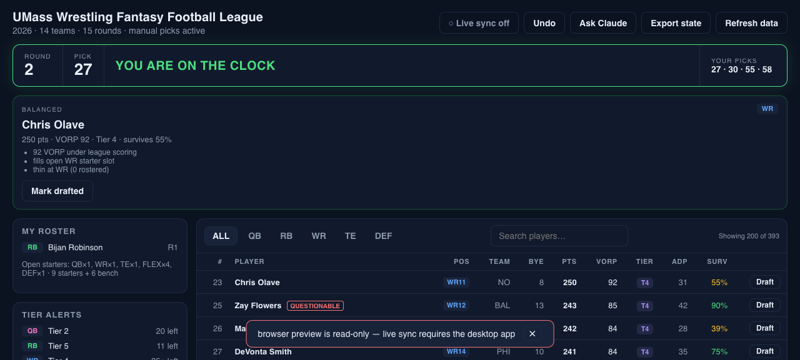

2. Click the first row's **Draft** button. The dialog opens; `document.activeElement` is still the table's Draft button.
   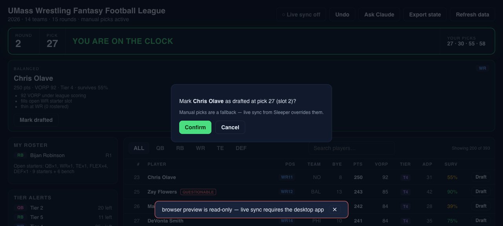

3. Press **Escape**.

4. **Observe:** the dialog is still open.
   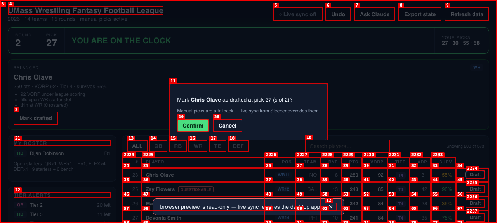

**Fixed 2026-08-28** (uncommitted): native `<dialog>` in `ConfirmDialog.tsx` — focus lands on Confirm, Escape and backdrop cancel, focus returns to the row's button; Playwright test `Escape cancels the draft confirmation and focus returns to the row`.

---

### ISSUE-002: Chat panel stops responding to Escape once focus leaves it

| Field | Value |
|-------|-------|
| **Severity** | medium |
| **Category** | functional |
| **URL** | http://localhost:1420 (same component in the desktop app) |
| **Repro Video** | videos/issue-002-repro-take2.webm |

**Description**

Escape-to-close was added to the Ask Claude panel this morning (commit `7dc277d`) as a keydown handler on the panel element. It works while the question box has focus, but clicking a suggested question removes that button from the DOM, focus falls to `<body>`, and Escape no longer reaches the panel. The same happens after any answer arrives if the user has clicked elsewhere. The panel then only closes via the ✕ button. Introduced by today's C5 change; **fixed in commit `295d2c9`** (document-level Escape while open, focus returned to the box after each answer; regression test added).

**Repro Steps**

1. Click **Ask Claude**. Focus is in the question box.
   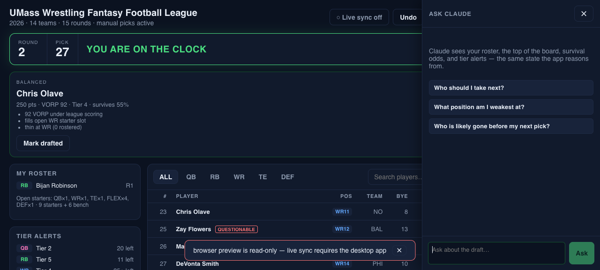

2. Click the suggestion **"Who should I take next?"**. Focus is now on `<body>`.
   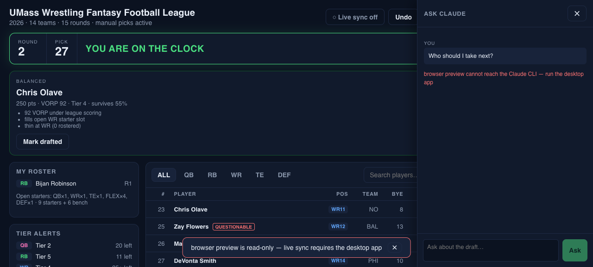

3. Press **Escape**.

4. **Observe:** the panel stays open. (Control: with focus back in the question box, Escape closes it.)
   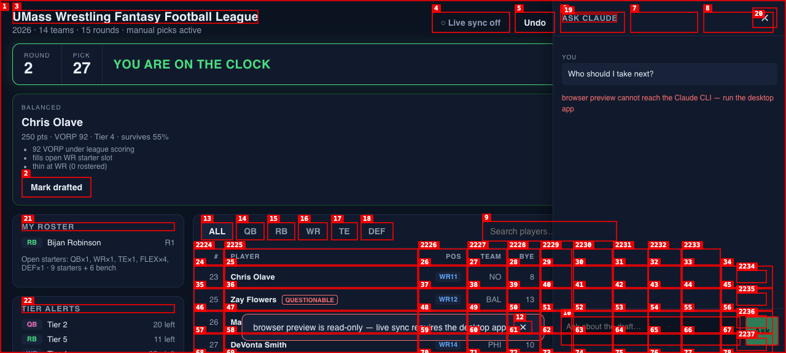

---

### ISSUE-003: Chat drawer covers the header controls and the board's decision columns

| Field | Value |
|-------|-------|
| **Severity** | medium |
| **Category** | ux |
| **URL** | http://localhost:1420 |
| **Repro Video** | N/A |

**Description**

The Ask Claude panel is a fixed 380 px overlay on the right. At the default 1360 px window it hides **Ask Claude / Export state / Refresh data** in the header and the board's **VORP, Tier, ADP, Surv, Draft** columns — exactly the numbers the user is asking Claude about, and the button they would click next. At the 1000 px minimum window width it also hides **Undo** and most of the board. Expected: the drawer pushes the layout (grid column) or the board scrolls horizontally, so the advice and the data sit side by side.

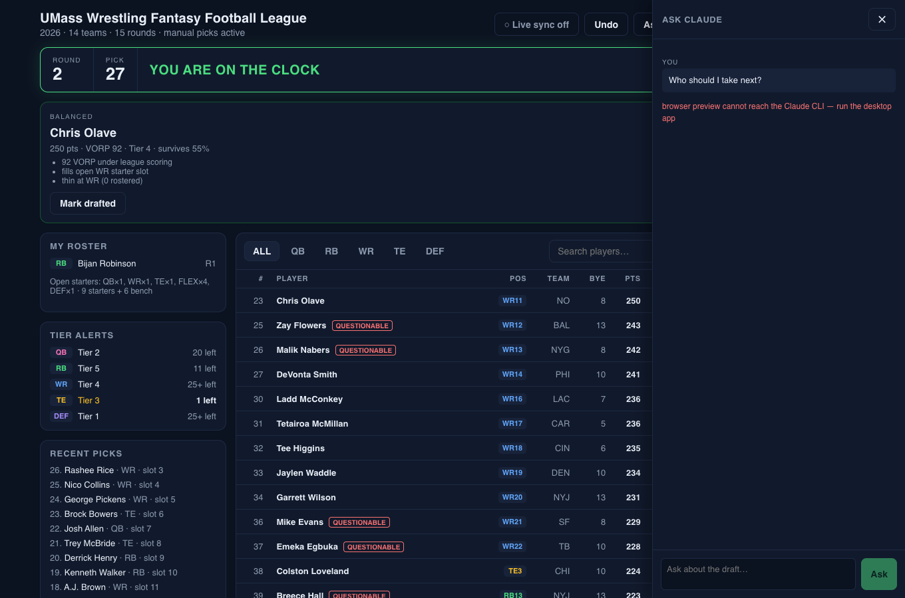
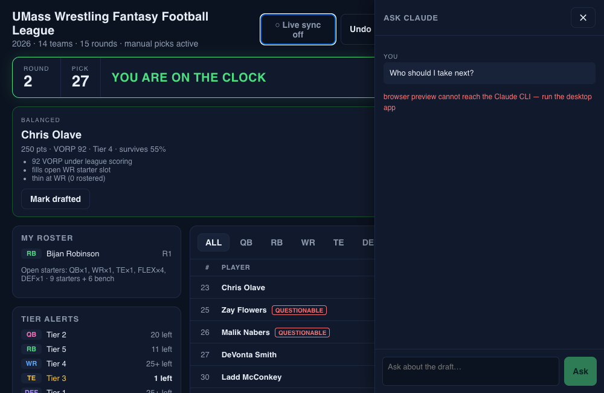

**Fixed 2026-08-28** (uncommitted): the panel is now a sticky flex column beside the page (`.shell` / `.chat` in `chat.css`); the board scrolls horizontally if the window is narrow. Playwright asserts the Refresh and Draft buttons end left of the panel.

---

### ISSUE-004: Persistent alert toast covers a board row

| Field | Value |
|-------|-------|
| **Severity** | low |
| **Category** | visual / ux |
| **URL** | http://localhost:1420 |
| **Repro Video** | N/A |

**Description**

Failures now stay on screen until dismissed (today's C3 change). The toast sits bottom-centre over the table, so while it is up one board row (here "Colston Loveland") is unreadable and its Draft button unreachable. A dismiss click fixes it, but an error that arrives mid-scan hides a player. Consider anchoring alerts under the clock banner or top-right, where nothing actionable lives.

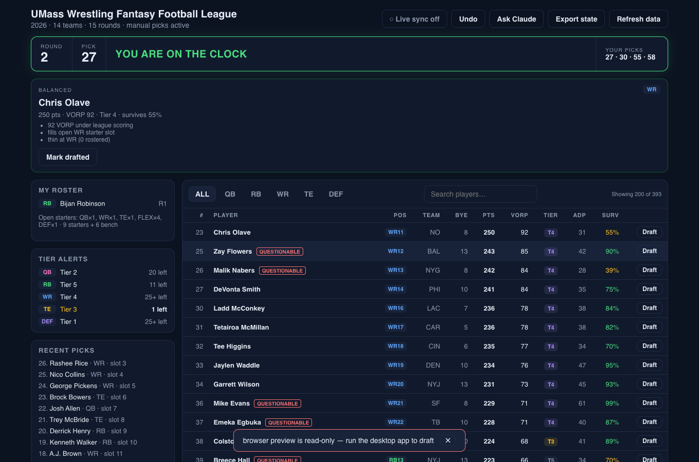

**Fixed 2026-08-28** (uncommitted): first moved top-right, which the live replay test then showed covering the header's own buttons when they wrap (`replay/report.md` R-1). Final fix: failures are an in-flow bar under the header; transient toasts are click-through.

---

### ISSUE-005: Header wraps awkwardly at the minimum window width

| Field | Value |
|-------|-------|
| **Severity** | low |
| **Category** | visual |
| **URL** | http://localhost:1420 at 1000×650 (the Tauri window's `minWidth`/`minHeight`) |
| **Repro Video** | N/A |

**Description**

At 1000 px the league name wraps to two lines and the live-sync pill breaks into "○ Live sync / off" on two lines, pushing the header to ~70 px. Everything remains usable; it just looks unfinished at a size the app explicitly permits.

**Fixed 2026-08-28** (uncommitted): league name ellipsises, header buttons wrap as whole units, the sync pill never breaks mid-word.

---

### ISSUE-006: Preseason "QUESTIONABLE" tags flag a quarter of the top 40 and are penalized as injuries

| Field | Value |
|-------|-------|
| **Severity** | low |
| **Category** | content / ux |
| **URL** | Live data via `dump_state` + http://localhost:1420 |
| **Repro Video** | N/A |

**Description**

On today's live board 10 of the top 40 (Nacua, Chase, McCaffrey, Walker, Flowers, Nabers, Jeanty, Evans, Egbuka, Hall) carry Sleeper's `Questionable` status — in late August that is mostly rest-day/preseason noise, not a draft signal. The red **QUESTIONABLE** badge renders on each, and the *safe* recommendation mode subtracts 15 points for any flag, so on draft night it will steer away from a quarter of the first-round pool. Consider muting the badge for `Questionable` and reserving the penalty for `Doubtful`/`Out`/`IR`.

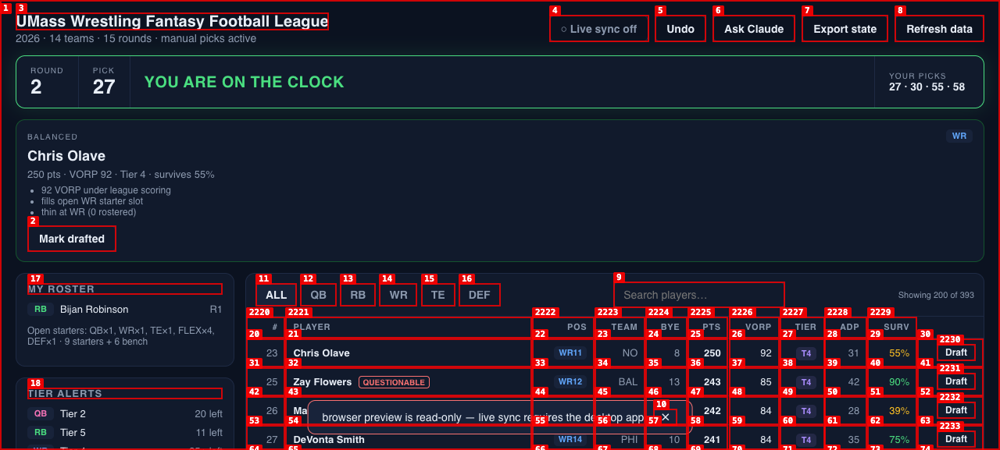

**Fixed 2026-08-28** (uncommitted): `recommend::serious_injury` limits the safe-mode penalty to out/ir/pup/sus/doubtful/na/cov; the board shows Questionable as a muted tag with a tooltip.

---

### ISSUE-007: Browser preview greets every load with a red failure alert

| Field | Value |
|-------|-------|
| **Severity** | low |
| **Category** | ux |
| **URL** | http://localhost:1420 (preview mode only; not the desktop app) |
| **Repro Video** | N/A |

**Description**

The preview is documented as read-only, yet the first thing it shows is a red, persistent alert — "browser preview is read-only — live sync requires the desktop app" — because the automatic live-sync start is treated as a failure. For an expected mode this should be a neutral info banner, not an error that must be dismissed before the page is clean.

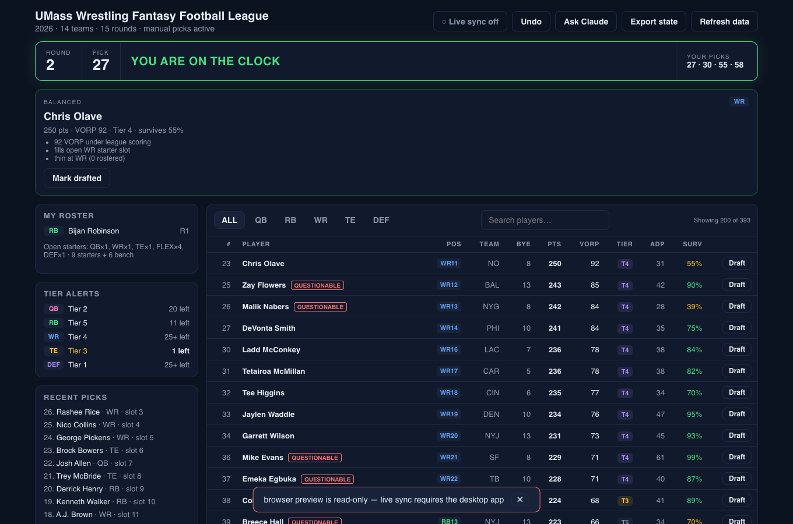

**Fixed 2026-08-28** (uncommitted): `api.preview` skips live sync and shows a neutral banner (`role="note"`); Playwright asserts no alert on load.

---

## Notes on the session

- Three times the Chromium session navigated itself to `about:blank` between commands (screenshots `preview-13`, `preview-14` are that blank page). Console and page errors were empty every time; it correlated with `set viewport` and long idle gaps, not with app actions. Treated as an `agent-browser` 0.23 artifact, not an app defect; every finding above was re-verified on a live page (`get url` + button count) before being recorded.
- Search, position filters, empty state, export/refresh/undo toasts, and the read-only guards all behaved correctly and are not listed.
